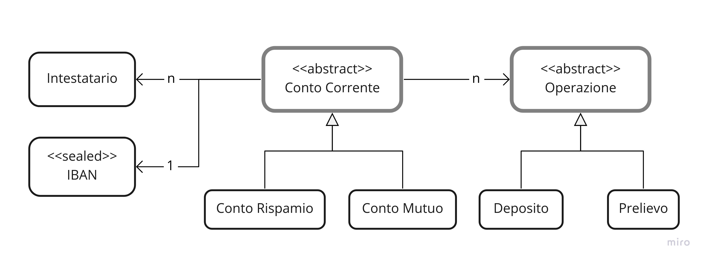

# **Scopo**
Questo progetto l'ho pensato e modellato per ripassare e applicare i 4 pilastri fondamentali del paradigma di programmazione ad oggetti:
- Astrazione (**Abstraction**)
- Incapsulamento (**Encapsulation**)
- Ereditarietà (**Inheritance**)
- Polimorfismo (**Polymorphism**)

Il progetto è focalizzato principalmente su questi 4 aspetti e riprende in parte un esempio proposto da Microsoft in una delle sue guide ufficiali. Questo significa che molte questioni non sono state considerate o approfondite. Cercherò di citarle nel paragrafo dedicato all'analisi e allo sviluppo della soluzione.


# **Descrizione del problema**
L'idea è quella di modellare un sistema che simuli la gestione dei conti corrente di una banca.<br>  

La banca in questione gestisce due tipi di conto corrente:
- Conto Mutuo
- Conto Risparmio

Un Conto Mutuo rappresenta un debito che l’intestatario contrae con la Banca in questione.<br>
In un Conto Mutuo possono essere fatti solo depositi destinati ad estinguere il debito, mentre non sono permessi prelievi.<br>
Un Conto Mutuo può essere aperto collegandolo ad un Conto Risparmio oppure indicando un IBAN esterno (va ovviamente anche indicato l'miporto del mutuo).<br>

In un Conto Risparmio è possibile sia prelevare che depositare denaro.<br>
Un Conto Risparmio può essere creato con una somma iniziale o con saldo zero.<br>
Il deposito non ha limite.<br>
Il prelievo massimo dipende dal singolo conto corrente.<br>
Il prelievo è concesso se il Saldo del conto corrente dopo il prelievo non è inferiore ad una certa soglia.<br>

Per ogni Conto Risparmio devono essere messi a disposizione dei report periodici entrate/uscite e per ogni conto corrente deve essere possibile visualizzare la lista dei movimenti dal giorno dell’apertura.<br>

Ogni conto corrente è identificato da un codice IBAN univoco.<br>

# **Definizione delle entità**

Dall'analisi del testo ho individuato le seguenti entità e le seguenti relazioni:

## **Conto Corrente**
Una classe astratta che rappresenta il concetto stesso al centro di questo esercio. La selta di renderla abstract dipende dal fatto che ai fini dell'esercizio istaniare un cocnto corrente non ha senso, ma hanno senso solo le sue specificazioni.

## **Conto Mutuo**
Rappresenta un conto corrente nel quale è possibile effettuare solo depositi per estinguere il debito.

## **Conto Risparmio**
Rappresenta un conto corrente e si differenzia dalla sua classe base in quanto deve mettere a disposizione dei report entrate-uscite (questo fatto giustifica la classe, altirmenti sarebbe identica alla classe base).

## **Operazione**
Rappresenta la generica operazione sul conto corrente. Anche in questo caso la scelta è ricaduta su una classe astratta, in quanto l'istanza di una operazione ha senso solo per una delle due specificazioni (pensate per questo esercizio)

## **Deposito**
Rappresenta una Operazione il cui importo deve essere positivo.

## **Prelievo**
Rappresenta una Operazione il cui importo deve essere negativo.

## **Intestatario**
Rappresenta l'intestatario del conto corrente (è una sorta di classe di servizio, per dare un senso di completezza all'esercizio).

## **IBAN**
Rappresenta il codice identificativo del conto corrente. In questo caso sono state fatte numerose semplificazioni: gli IBAN gestiti sono solo italiani, non ci sono controlli sulla correttenza dei dati (in particolare del numero del conto corrente). Anche in questo caso serve a dare un po' un senso di completezza all'esercizio.

# **Diagramma delle relazioni**



# **Descrizione della soluzione**
In questa sezione cercherò di mettere in relazione i concetti propri dei 4 pilastri con le scelte che ho attuato nel progetto.

## **Abstraction**
Il processo di Astrazione si fonda sulla selezione degli elementi essenziali per permettere l'utilizzo del sistema. 
Per questo esercizio ho (arbitrriamente) deciso che le informazioni essenziali per gestire un intestatario fossero un costruttore, un metodo per modificare i dati anagrafici e l'override del metodo Tostring().
Ovviamente, l'implementazione di questo pilastro utilizza principalmente le stesse keyword del processo di Incapsulamento. In un certo senso sono due facce della stessa medaglia, ma lo spirito con cui si approcciano è nettamente diverso.

## **Ecapsulation**
In questo caso il processo riguarda due aspetti:
- raggruppare dati e funzioni all'interno di un insieme coerente (una classe)
- proteggere l'accesso ai dati di questo insieme.

Si tratta quindi di definire i "protocolli" attraverso i quali è possibile accedere (in lettura o scrittura) ai dati della classe.

Prendiamo ad esempio la classe Operazione:
- i suoi dati sono "nascosti" dalle proprietà (particolarità del linguaggio C# che ingloba field privato, setter e getter);
- i suoi dati possono essere letti da tutti ma scritti solamente dalla classe stessa o dalle classi derivate (Prelievo e Deposito);
- l'unico metodo messo a disposizione per modificare i dati è il costruttore;

Un ragionamento analogo può essere fatto per la classe IBAN:
- l'unica informazione reperibile è il codice IBAN, mentre tutte le sue singole componenti sono protette da accessi esterni sia in lettura che in scrittura.

## **Inhertiance**
Ci sono due esempi di ereditarietà in questo progetto:
- La classe astratta ContoCorrente da cui derivano ContoRisparmio e ContoMutuo
    - In particolare ContoMutuo 
        - specializza la proprietà Saldo tenendo in considerazione l'importo concesso a mutuo;
        - specializza il metodo Deposita() verificando se il mutuo è estito e prelevando contestualmente la rata dal ContoRisparmio associato;

- La classe astratta Operazione da cui derivano Deposito e Prelievo
    - Entrambe le classi derivate specializzano il costruttore modificando l'importo dell'operazione.

Ho utilizzato solo classi astratte per questo esercizio, quindi nno è stato implemetato il method hiding (attraverso la keyword new).

## **Polymorphism**
La potenza del polimorfismo, specialmente il suo comportamento a runtime, la si può apprezzare da questo test:

```cs
    private ContoCorrente contoMutuoUnderTest;

    [TestMethod]
    public void ContoMutuoEsternoDeposito()
    {
        // Arrange
        this.contoMutuoUnderTest = this.mutuoIBANEsterno();

        // Act
        this.contoMutuoUnderTest.Deposita(100.00M, "Rata mutuo");

        // Assert
        Assert.AreEqual(-99900.00M, this.contoMutuoUnderTest.Saldo);
        Assert.AreEqual(1, this.contoMutuoUnderTest.ElencoOperazioni.Count);
    }

    private ContoMutuo mutuoIBANEsterno()
    {
        return new ContoMutuo(
            intestatari: this.intestatari,
            importoMutuo: 100000.00M,
            IBANAssociato: "IT02L1234500000200000000011"
        );
    }
```
A runtine il metodo Deposita() eseguito sarà quello di contoMutuo.

### **Method Overloading**
Ci sono esempi in ContoRisparmio:
- ReportEntrateUscite();
- ReportEntrateUscite(int);
Ci sono esempi in ContoMutuo:
- ContoMutuo(ICollection<Intestatari>, decimal, ContoRisparmio);
- ContoMutuo(ICollection<Intestatari>, decimal, string);
Ci sono esempi in Contocorrente:
- ContoCorrente(ICollection<Intestatari>, decimal, decimal);
- ContoCorrente(ICollection<Intestatari>, decimal);

### **Method Overriding**
Lo ho già citato in precedenza, quindi ricito solo il metodo ContoMutuo.Deposita(decimal, string) perchè degno di nota.


# **Cose che ci sarebbero potute essere ma che non ci sono (elenco disordinato)**
Domande e considerazioni lecite ma che non erano indispensabili agli scopi del progetto.
Alcune di queste potrebbe venire implementate in futuro:

- Mancano i controlli sul codice fiscale (Intestatario);
- Non è stata calcolata la data di nascita in modo automatico (Intestatario);
- Una operazione dovrebbe avere un identificativo ed essere riconoscibile (Operazione);
- Una operazione dovrebbe essere annullabile (Operazione);
- Un conto corrente dovrebbe essere eliminabile;
- Gli importi immessi in input dovrebbero essere forzati ad essere sempre positivi, in quanto è il sistema che gestisce automaticamente i segni in caso di prelievi o depositi (un deposito negativo verrebbe accettato dal sistema e costiuisce di fatto un bug);
- ... e tante altre cose!

# **Conclusione**
Nella speranza che a qualcuno possa tornare utile :)
